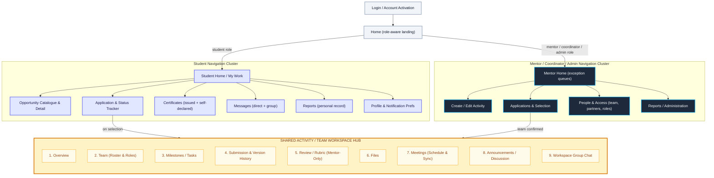

# VBridgeConnect — Comprehensive Design Specification & System (DESIGN.md)

**Companion to:** `VBridgeConnect_Technical_PRD.docx` & `architecture.md`  
**Purpose:** Single source of truth for UI/UX, Design Tokens, Screen Architecture, Stitch AI Generation, and Figma Handoff.  
**Tech Stack Alignment:** React + TypeScript + Tailwind CSS (as defined in `rules.md`).  
**Status:** Approved for Design & Prototyping (No application code written yet).

---

## Table of Contents
1. [Design Philosophy & Core Principles](#1-design-philosophy--core-principles)
2. [Design System & Token Architecture](#2-design-system--token-architecture)
   - Color Palette & Semantic Roles
   - Typography Scale (Inter & Plus Jakarta Sans)
   - Spacing & Layout Grids
   - Elevation, Shadows & Corner Radii
3. [Information Architecture & Role-Based Navigation](#3-information-architecture--role-based-navigation)
4. [Component Library & UI Patterns](#4-component-library--ui-patterns)
   - Status Badges & State Machine Visuals
   - Rubric Evaluation Slider / Cards
   - Certificate Distinction (Platform-Issued vs Self-Reported)
   - Team Risk Indicator Chips
5. [The 14 MVP Screen Specifications](#5-the-14-mvp-screen-specifications)
   - Screen 1: Unified Login & SSO Portal
   - Screen 2: Student Personal Dashboard
   - Screen 3: Faculty Mentor Cohort Dashboard
   - Screen 4: Activity & Opportunity Catalogue
   - Screen 5: Activity Builder & Milestone Setup
   - Screen 6: Application Review & Selection Pipeline
   - Screen 7: Active Team Project Workspace
   - Screen 8: Milestone Tracking & Health Dashboard
   - Screen 9: Deliverable Submission & Version History
   - Screen 10: Rubric Grading & Structured Assessment
   - Screen 11: Certificate Verification & Portfolio Hub
   - Screen 12: Contextual Messaging & Team Chat
   - Screen 13: Department Directory & Role Permissions
   - Screen 14: Department Analytics & Audit Reports
6. [Stitch AI Generation Prompts (Desktop & Mobile)](#6-stitch-ai-generation-prompts-desktop--mobile)
7. [Figma Handoff & Auto-Layout Guide](#7-figma-handoff--auto-layout-guide)

---

## 1. Design Philosophy & Core Principles

- **PR-01 (Single Source of Truth):** Dashboards always reflect actual real-time database state (no manual out-of-band spreadsheets).
- **Institutional Trust & Academic Clarity:** Clean, uncluttered academic interface that balances student vibrancy with administrative rigor.
- **Strict Role Boundaries:** Clear visual differentiation and scoped visibility for 6 distinct personas: Student, Faculty Mentor, Coordinator, Reviewer, Industry Partner, Super Admin.
- **Unambiguous State Feedback:** Every item in a state machine (Activity, Application, Milestone, Submission, Team Risk, Certificate) must have a deterministic badge color and status icon.
- **Audit-Ready & Immutable:** UI must visually communicate version history (e.g., v1 vs v2 submissions) and audit trails.

---

## 2. Design System & Token Architecture

### 2.1 Color Palette & Semantic Roles
Configured for Tailwind CSS theme extension:

```javascript
// tailwind.config.js snippet
module.exports = {
  theme: {
    extend: {
      colors: {
        brand: {
          50: '#EEF2FF',
          100: '#E0E7FF',
          500: '#4F46E5', // Primary brand color: Indigo
          600: '#4338CA',
          700: '#3730A3',
          900: '#1E1B4B',
        },
        slate: {
          50: '#F8FAFC',  // Main page background
          100: '#F1F5F9', // Card headers / table headers
          200: '#E2E8F0', // Border subtle
          300: '#CBD5E1', // Border strong
          600: '#475569', // Secondary body text
          900: '#0F172A', // Primary heading text
        },
        // State Machine Badges & Risk Indicators
        state: {
          draft: { bg: '#F1F5F9', text: '#475569', border: '#CBD5E1' },
          pending: { bg: '#FEF3C7', text: '#B45309', border: '#FCD34D' }, // Amber
          active: { bg: '#E0E7FF', text: '#3730A3', border: '#A5B4FC' },  // Indigo/Blue
          success: { bg: '#DCFCE7', text: '#15803D', border: '#86EFAC' }, // Emerald
          warning: { bg: '#FFEDD5', text: '#C2410C', border: '#FDBA74' }, // Orange
          danger: { bg: '#FEE2E2', text: '#B91C1C', border: '#FCA5A5' },  // Rose/Red
          archived: { bg: '#F3F4F6', text: '#6B7280', border: '#D1D5DB' } // Gray
        }
      }
    }
  }
}
```

### 2.2 Typography Scale
- **Headings & Accents:** `Plus Jakarta Sans` (Geometric, modern, human-centric)
- **Body & Data:** `Inter` (High legibility, tabular numbers for dates and scores)
- **Code & IDs:** `JetBrains Mono` (UUIDs, verification codes, submission hashes)

| Token | Size | Line Height | Weight | Usage |
|:---|:---|:---|:---|:---|
| `text-xs` | 12px (0.75rem) | 16px | 400 / 500 | Metadata, timestamps, table captions |
| `text-sm` | 14px (0.875rem)| 20px | 400 / 500 | Secondary copy, form labels, badges |
| `text-base` | 16px (1rem) | 24px | 400 / 500 | Standard body copy, inputs |
| `text-lg` | 18px (1.125rem)| 28px | 600 | Card titles, modal headers |
| `text-xl` | 20px (1.25rem) | 28px | 600 / 700 | Section headers |
| `text-2xl` | 24px (1.5rem)  | 32px | 700 | Screen headers, KPIs |
| `text-3xl` | 30px (1.875rem)| 36px | 800 | Hero metrics, landing titles |

### 2.3 Layout Grids & Responsive Breakpoints
- **Desktop (1280px+):** 12-column grid, 24px gutters, fixed or collapsible 260px left sidebar.
- **Tablet (768px - 1024px):** 8-column grid, 16px gutters, collapsible drawer navigation.
- **Mobile (< 768px):** 4-column grid, 12px margins, sticky bottom navigation bar (5 items) + top app bar with role avatar & notifications.

### 2.4 Shadows & Radii
- **Border Radius:** Default `rounded-xl` (12px) for cards, modals, and buttons; `rounded-full` for status badges.
- **Shadows:**
  - `shadow-sm`: Standard card resting state (`0 1px 2px 0 rgb(0 0 0 / 0.05)`).
  - `shadow-md`: Hover states and popovers (`0 4px 6px -1px rgb(0 0 0 / 0.1)`).
  - `shadow-xl`: Flyout drawers, evaluation panels, and modal dialogs.

---

---

## 3. Information Architecture & Role-Based Navigation (Per Official IA Map)

The navigation structure conforms strictly to the **Information Architecture Map** (`VBridgeConnect_IA_Map.pdf`). It establishes a role-aware entry point that bifurcates into Student vs. Mentor/Coordinator/Admin clusters, converging on a **single, shared Activity/Team Workspace hub** once a team is formed.

### 3.1 Information Architecture Flow Diagram



### 3.2 Key Structural Rules (from IA Map)

1. **Single Workspace Hub Per Activity/Team:**
   - There is exactly **one** Workspace hub per activity/team. Students reach it via *Application & Status Tracker* (on selection); Mentors reach it via *Applications & Selection* (on team confirmation). Both land in the exact same workspace, but **permissions differ inside it**.
2. **Mentor-Only Controls Inside Workspace:**
   - Tab 5 (*Review / Rubric*) and its evaluation tools are strictly visible to Mentors/Reviewers only. Student access is blocked by server-side scope enforcement (PR-01 to PR-08).
3. **Three Critical Secondary Relationships (Omitted from map drawing for clarity):**
   - **Rule 1 (Direct Shortcut):** `Student Home` and `Mentor Home` also link directly to any already-joined or already-assigned workspace (bypassing the application trackers).
   - **Rule 2 (Completion-Triggered Certificate):** A platform-issued certificate is generated directly from the **Review / Rubric completion step**, NOT from a disconnected admin action.
   - **Rule 3 (Unified Messaging Surface):** A student's global `Messages` screen and a workspace's `Workspace Group Chat` tab surface the **exact same underlying message thread** from two distinct entry points.

### 3.3 Role-Based View Matrix
1. **Student:** Student Home / My Work, Opportunity Catalogue, Application Tracker, Personal Reports, Profile & Notification Prefs, and Shared Team Workspace.
2. **Faculty Mentor:** Mentor Home (Exception Queues & At-Risk Matrix FR-070), Applications & Selection, Review / Rubric Workspace, and Direct/Group Messaging.
3. **Coordinator:** Activity Creator/Editor Wizard, Selection Pipeline, Department Directory & Role Access, and Department Accreditation Reports.
4. **Industry Partner (FR-092):** Scoped access to shared project deliverables, feedback discussions, and workspace group chat (strictly isolated from student GPAs, grades, and private faculty notes).
5. **Super Admin / Dean:** Institutional governance, cross-department analytics, audit ledger, and security configuration.

---

## 4. Component Library & UI Patterns

### 4.1 State Machine Badges
Every entity status must strictly map to a token badge:
- **Activity Status:** `Draft` (Slate), `Open for Applications` (Amber), `In Progress` (Indigo), `Under Review` (Purple), `Completed` (Emerald), `Archived` (Gray).
- **Application Status:** `Submitted` (Amber), `Waitlisted` (Orange), `Accepted` (Emerald), `Rejected` (Rose).
- **Milestone Status:** `Not Started` (Slate), `Open` (Blue), `Submitted` (Purple), `Accepted` (Emerald), `Changes Requested` (Amber), `Overdue` (Red).

### 4.2 Team Risk Indicators (FR-070 to FR-075)
Visual chips displayed prominently on Mentor and Coordinator views:
- 🟢 **On Track:** Milestones submitted on or ahead of time.
- 🟡 **Needs Attention:** Milestone due in <48 hours with no draft submission, or 1 revision requested.
- 🔴 **At Risk:** Milestone overdue >48 hours, mentor blocker logged, or 2+ consecutive revision requests.

### 4.3 Certificate Visual Distinction (FR-114 & FR-115)
- **Official Platform-Issued:** Deep Indigo border, verified checkmark icon, cryptographic hash preview, scanable QR code, "Verified by Department" gold foil badge.
- **Student Self-Reported:** Dashed neutral border, "Self-Reported" badge in Slate Gray, disclaimer watermark: *"Not audited by university authorities"*, upload receipt link.

---

## 5. The 14 MVP Screen Specifications

---

### Screen 1: Unified Login & SSO Portal
- **Route:** `/login`
- **Primary Goal:** Role-aware authentication supporting Institutional SAML/OIDC and email fallback.
- **Layout (Desktop):** Split-screen layout. Left side: 60% brand illustration of interdisciplinary collaboration, live metric ticker (*"1,420 Active Projects · 98% Completion Rate"*). Right side: 40% clean white authentication card.
- **Layout (Mobile):** Single column, top branded hero banner, card elevation with SSO button upfront.
- **Key Elements:**
  - One-click button: *"Sign in with University Portal (SSO)"*.
  - Divider: *"Or use institutional email"*.
  - Department selector dropdown for demo/multi-tenant switching.
  - Role preview indicator (shows what role your institutional ID maps to).

---

### Screen 2: Student Personal Dashboard
- **Route:** `/student/dashboard`
- **Primary Goal:** Actionable personal hub for all active projects, deadlines, and accomplishments.
- **Key Metrics Bar:** 4 Stat Cards — Active Activities (Count), Pending Milestones (Count), Applications in Review (Count), Earned Badges/Certs (Count).
- **Primary Section:** **Next Up / Urgent Actions** — Banner highlighting the earliest milestone due in < 72h with direct *"Submit Deliverable"* CTA.
- **Secondary Section:** **My Enrolled Teams & Projects** — 2-column card grid showing project thumbnail, team members avatars, current milestone progress bar (e.g. 3 of 5 complete), and mentor contact chip.
- **Mobile View:** Single column cards, horizontal scroll for enrolled activities, sticky quick-action FAB to open team chat.

---

### Screen 3: Faculty Mentor Cohort Dashboard
- **Route:** `/mentor/dashboard`
- **Primary Goal:** Manage assigned activities, monitor team velocity, and intervene on stalled teams (FR-070 to FR-075).
- **Key Layout:**
  - Top Filter Bar: Activity selector, Department filter, Risk Level toggle (All / At Risk / Needs Review).
  - **Cohort Risk Matrix:** Visual priority list highlighting flagged teams at the top with reason pills (e.g. *"Overdue: Milestone 2 by 3 days"*).
  - **Review Queue:** Pending submissions requiring rubric grading with submission date, team name, and *"Grade Now"* button.
  - Quick action: Bulk nudge/reminder button to notify all teams with deadlines in 48 hours.

---

### Screen 4: Activity & Opportunity Catalogue
- **Route:** `/activities`
- **Primary Goal:** Discover research, hackathons, capstones, and industry-sponsored projects.
- **Controls:**
  - Search bar with debounce (search by title, skill, faculty sponsor).
  - Multi-select filters: Category (Research / Hackathon / Capstone), Department (CS, ME, EE), Eligible Cohorts, Capacity (Open / Filling Fast).
- **Card Design:**
  - Banner image, host department badge, application deadline counter.
  - Capacity progress bar: *"24 / 30 slots filled"*.
  - Prerequisites tags (e.g. `Python`, `IoT`, `Senior Year`).
  - Action button: *"Apply Now"* (disabled if deadline passed or already applied).

---

### Screen 5: Activity Builder & Milestone Setup
- **Route:** `/coordinator/activities/new`
- **Primary Goal:** Multi-step wizard for faculty/coordinators to define an activity and its progression.
- **Wizard Steps:**
  1. *Basics:* Title, Description, Department, Max Capacity, Team Size limits (min/max).
  2. *Application Criteria:* Selection rubric, application deadline, prerequisite questions.
  3. *Milestone Builder:* Reorderable drag-and-drop milestone list with title, description, due date, mandatory deliverable type (PDF, GitHub repo, ZIP), and weightage %.
  4. *Mentor & Partner Assignment:* Assign faculty mentors and industry reviewers (FR-092).
  5. *Review & Publish:* Draft or Publish toggle with validation checklist.

---

### Screen 6: Application Review & Selection Pipeline
- **Route:** `/coordinator/activities/:id/applications`
- **Primary Goal:** Review, score, and accept/reject applicants with real-time capacity locks (QA-10).
- **Layout:** Kanban-style board or segmented table:
  - Columns: `Submitted (18)` | `Shortlisted (8)` | `Accepted (12/15)` | `Waitlisted (4)` | `Rejected (2)`.
  - Application Drawer: Clicking any student opens a slide-over panel with their GPA, statement of purpose, portfolio link, and reviewer scoring notes.
  - Sticky Footer: Remaining capacity counter and *"Send Batch Decisions"* button.

---

### Screen 7: Active Team Project Workspace (The Shared Hub)
- **Route:** `/projects/:id` (accessible via deep-link from Student Home, Mentor Home, or selection trackers)
- **Primary Goal:** The single operational hub where students and their assigned mentors collaborate on a confirmed activity.
- **Header:** Team Name, Activity Title, Mentor Badge, Team Health Status Chip (On Track / At Risk), Quick Actions.
- **The 9 Scoped Workspace Tabs (Per IA Map):**
  1. **Overview:** Next upcoming deadline countdown, recent activity timeline feed, project summary, and quick links.
  2. **Team:** Team member roster with designated roles (Lead, Contributor), skills, and contact chips.
  3. **Milestones / Tasks:** Structured milestone roadmap with state badges, due dates, and weightage %.
  4. **Submission & Version History:** Deliverable upload interface with immutable version history drawer (FR-052) for v1, v2, etc.
  5. **Review / Rubric (Mentor-Only):** Evaluation panel with score sliders and private notes (strictly hidden from students by role-based scope guard).
  6. **Files:** Repository of project assets, datasets, architecture diagrams, and signed S3 attachments.
  7. **Meetings:** Scheduled mentor sync slots, lab office hour bookings, and shared agenda notes.
  8. **Announcements / Discussion:** Official faculty broadcast notices and asynchronous threaded Q&A.
  9. **Workspace Group Chat:** Dedicated team chat channel (surfaces the same underlying thread as the student's global `/messages` screen).

---

### Screen 8: Milestone Tracking & Health Dashboard
- **Route:** `/projects/:id/milestones`
- **Primary Goal:** Visual timeline showing the end-to-end lifecycle of project deliverables.
- **Layout:**
  - Interactive Stepper / Gantt timeline across the top.
  - Milestone Detail Cards:
    - Milestone number and title.
    - Due date with overdue badge if past deadline.
    - Current state badge (`Submitted`, `Changes Requested`, `Accepted`).
    - Rubric criteria list with score breakdown.
    - Mentor feedback callout box.

---

### Screen 9: Deliverable Submission & Version History
- **Route:** `/projects/:id/milestones/:mId/submit`
- **Primary Goal:** Immutable file upload with version tracking (FR-052).
- **Key Features:**
  - Drag-and-drop file uploader supporting PDF, DOCX, ZIP (max 50MB) and URL links (GitHub, Figma, Demo video).
  - Student note / summary textarea.
  - **Version History Drawer (FR-052):** Shows previous uploads (`v1 - Oct 12`, `v2 - Oct 15`) with mentor change requests, timestamps, and download links. Immutable notice: *"Submissions cannot be edited after final review"*.

---

### Screen 10: Rubric Grading & Structured Assessment
- **Route:** `/mentor/submissions/:id/grade`
- **Primary Goal:** Fast, objective rubric evaluation for faculty mentors and reviewers.
- **Layout (Desktop Split Screen):**
  - Left Panel (60%): Document previewer (PDF viewer or live link frame) with version metadata.
  - Right Panel (40%): Interactive Rubric Scoring Card.
    - Criterion 1: Technical Execution (0 to 10 points) with descriptive sliders.
    - Criterion 2: Innovation & Creativity (0 to 10 points).
    - Criterion 3: Documentation & Presentation (0 to 10 points).
    - Private Faculty Notes (hidden from students).
    - Public Constructive Feedback textarea.
    - Action Buttons: `Request Changes` (requires comment) vs `Accept & Grade`.

---

### Screen 11: Certificate Verification & Portfolio Hub
- **Route:** `/certificates`
- **Primary Goal:** Digital credentials management with public verification (FR-114, FR-115).
- **Tab 1: Platform-Issued Credentials:**
  - Rich certificate card with foil gradient, verified seal, activity name, completion date, and direct buttons: *"Download PDF"*, *"Add to LinkedIn"*, *"Copy Verification URL"*.
  - Built-in QR Code modal that leads to public verify endpoint `/verify/:certHash`.
- **Tab 2: Self-Reported External Certifications:**
  - Distinct dashed visual frame, "Self-Reported" gray badge, upload date, and edit/delete actions.

---

### Screen 12: Contextual Messaging & Team Chat
- **Route:** `/messages`
- **Primary Goal:** Scoped, audited communication channels (FR-120 to FR-126).
- **Layout:**
  - Left Column (30%): Scoped channel list organized by Activity & Team (e.g. `#team-alpha-capstone`, `#mentor-office-hours`, `#announcements`).
  - Right Column (70%): Chat transcript with pinned guidelines, date dividers, message bubbles with sender role badges (`[Mentor] Dr. Sharma`), file attachment preview, and search.

---

### Screen 13: Department Directory & Role Permissions
- **Route:** `/admin/people`
- **Primary Goal:** Manage faculty, coordinators, and students across academic cohorts.
- **Controls:**
  - Search by name, PRN/Roll number, or email.
  - Role filter pills (`All`, `Faculty`, `Students`, `Industry Partners`).
  - Actions: Assign Activity, Update Department Scope, Revoke Access.
  - Batch Invite modal via CSV upload.

---

### Screen 14: Department Analytics & Audit Reports
- **Route:** `/admin/reports`
- **Primary Goal:** High-level metrics, accreditation exports (NAAC/NIRF), and immutable audit logs.
- **Visuals:**
  - KPI Cards: Total Student Participation, Average Completion Rate, Industry Engagement Index.
  - Completion Funnel Chart: Applied → Accepted → Midterm Cleared → Completed.
  - Audit Trail Table: Timestamp (UTC), Actor, Target Entity, Action, IP Address.
  - One-click Export buttons: *"Export NAAC Activity Report (CSV)"*, *"Export Accreditation PDF"*.

---

## 6. Stitch AI Generation Prompts (Desktop & Mobile)

When running the Stitch MCP tool, use these exact prompt templates:

### Project Creation Spec
- **Project Title:** `VBridgeConnect MVP`
- **Design System:**
  - Primary Color: `#4F46E5` (Indigo)
  - Secondary Color: `#0F172A` (Slate Dark)
  - Background: `#F8FAFC` (Slate Light)
  - Typography: `Plus Jakarta Sans` (Display/Headings), `Inter` (Body)
  - Roundness: `ROUND_TWELVE` (12px)
  - Style Variant: `TONAL_SPOT`

### Screen-Specific Stitch Prompts

#### Screen 1: Login Portal
> **Desktop Prompt:** `Modern, high-trust academic portal login screen for VBridgeConnect. Split-screen layout. Left side: dark indigo branding card (#1E1B4B) with abstract geometric collaboration graphic, institutional tagline, and key statistics (1,400+ student projects). Right side: clean white authentication card with primary button 'Sign in with University Portal (SSO)' featuring university shield icon, divider line 'Or use institutional credentials', email and password inputs, role-based demo selector dropdown, and college footer with NAAC accreditation badge. Highly polished, modern typography in Plus Jakarta Sans.`
> 
> **Mobile Prompt:** `Mobile login screen for VBridgeConnect university collaboration platform. Clean white background with top indigo curved banner with college logo. Prominent 'Sign in with University SSO' button with academic seal icon. Clean email/password inputs, 'Forgot Password?' link, role preview pill, and security badge at bottom. Modern iOS/Android aesthetic with rounded corners and high legibility.`

#### Screen 2: Student Dashboard
> **Desktop Prompt:** `Comprehensive student personal dashboard for VBridgeConnect. Slate-50 background. Top navigation bar with student avatar and notifications. Header welcoming student with current semester tag. Top row: 4 KPI metric cards with icons (Active Projects: 2, Upcoming Milestones: 1, Applications: 1, Verified Certificates: 3). Main section: 'Urgent Action Required' amber alert card for Hackathon 2026 Milestone 2 due in 36 hours with 'Submit Deliverable' CTA. Grid of 2 active project cards with team member avatars, milestone progress bar (60%), and mentor contact tag. Clean, modern SaaS aesthetic, Indigo primary accents.`
> 
> **Mobile Prompt:** `Mobile student dashboard for university activity platform. Sticky top bar with university logo, search icon, and avatar. Horizontal scrollable metric chips (2 Active Projects, 1 Due Soon). Prominent yellow/amber card for upcoming milestone deadline with countdown timer and primary 'Submit' button. Vertical stack of 2 project cards with progress bars and team avatars. Fixed bottom navigation bar with 4 tabs (Home, Projects, Messages, Profile).`

#### Screen 3: Mentor Cohort Dashboard
> **Desktop Prompt:** `Faculty Mentor cohort oversight dashboard for university research and capstone projects. Clean SaaS UI. Header with department selector and 'Batch Reminder' action button. Highlighted section: 'Cohort Health & Risk Matrix' displaying 3 flagged teams with red and orange status badges ('Overdue 2 days', 'Revision Requested'). Below: 'Submissions Pending Evaluation' data table with columns (Team Name, Activity, Milestone, Submitted Date, Rubric Weightage, Action button 'Evaluate Now'). Modern academic administration interface with clear visual hierarchy.`
> 
> **Mobile Prompt:** `Mobile mentor dashboard for university faculty. Top section with urgent review alert counter (3 pending). Tab filter: 'At Risk (2)' and 'Pending Review (5)'. Stack of team review cards showing team name, milestone title, submitted timestamp, and prominent primary button 'Grade Submission'. Pull-to-refresh layout with bottom navigation.`

#### Screen 4: Opportunity Catalogue
> **Desktop Prompt:** `Opportunity and activity marketplace catalogue for university students. Header with search bar and filter chips (All Departments, Capstone, Research, Hackathons, Open Capacity). 3-column responsive card grid. Each card features: category pill badge (e.g. 'Industry Hackathon'), title, faculty supervisor avatar, capacity progress bar ('22 / 30 seats filled'), prerequisite tags, deadline counter, and 'Apply Now' primary button. Clean slate background with crisp card borders.`
> 
> **Mobile Prompt:** `Mobile opportunity discovery catalogue. Sticky search bar at top with filter icon. Vertically stacked activity cards with department badge, title, capacity bar, deadline tag, and large tap-friendly 'Apply' button. Filter drawer trigger button floating at bottom.`

#### Screen 10: Rubric Grading Screen
> **Desktop Prompt:** `Interactive mentor rubric grading and evaluation screen for project submissions. Split-screen desktop layout. Left 60%: embedded PDF viewer and link preview of student deliverable with version tag 'v2 (Latest)'. Right 40%: structured rubric grading panel. Interactive slider bars for Criterion 1 (Technical Merit: 8/10), Criterion 2 (Innovation: 9/10), and Criterion 3 (Documentation: 7/10). Private mentor notes textarea, public student feedback textarea, and two action buttons: 'Request Changes' (amber outline) and 'Accept & Publish Grade' (emerald solid). Highly functional and clear.`
> 
> **Mobile Prompt:** `Mobile rubric evaluation screen for faculty mentors. Top deliverable header with 'View Attachment' button. Accordion list of 3 rubric scoring criteria with point selectors (1 to 10). Feedback textarea and bottom sticky button bar with 'Request Revisions' and 'Approve'.`

#### Screen 11: Certificate Hub
> **Desktop Prompt:** `Digital credentials and certificate verification hub for university student portfolio. Header with 'Download All' button and tab toggle: 'Platform-Verified Credentials' and 'Self-Reported Certifications'. Showcase grid of official certificates featuring rich dark-indigo border, gold verification seal, student name, activity title, issue date, and QR code for public validation. Card actions: 'Download PDF', 'Verify On-Chain/Hash', 'Add to LinkedIn'. Separate section with dashed border for self-reported certificates with disclaimer watermark.`
> 
> **Mobile Prompt:** `Mobile certificate portfolio screen. Top segmented control for 'Verified' and 'Self-Reported'. Vertical carousel of official certificate preview cards with gold seal badge, QR code preview button, and bottom sheet action to share or download PDF.`

---

## 7. Figma Handoff & Auto-Layout Guide

For designers building or refining these screens in Figma:

### 7.1 Frame & Artboard Dimensions
- **Desktop Frames:** `1440px × 1024px` (Content max-width: `1200px` centered, Sidebar: `260px` fixed).
- **Mobile Frames:** `393px × 852px` (iPhone 15 / 16 standard viewport, 16px horizontal margins).
- **Modal Dialogs:** `640px` width, centered with 40% black backdrop blur.
- **Slide-Over Drawers:** `480px` width, right-aligned, full viewport height.

### 7.2 Figma Component Variants to Create
1. **Button Component:**
   - Sizes: `Sm (36px)`, `Md (44px)`, `Lg (52px)`
   - Variants: `Primary (Indigo)`, `Secondary (Slate outline)`, `Destructive (Rose)`, `Ghost (Transparent)`
   - States: `Default`, `Hover`, `Focused`, `Disabled`, `Loading`
2. **Status Badge Component:**
   - Properties: `Entity (Activity | Milestone | TeamRisk | Certificate)`, `Status (Draft | Active | Overdue | Accepted | Rejected)`
   - Auto-layout: Horizontal, `padding: 4px 10px`, `radius: 9999px`.
3. **Rubric Slider Component:**
   - Properties: `MaxPoints (5 | 10 | 20)`, `CurrentValue (Number)`, `Disabled (Boolean)`

### 7.3 Auto-Layout Best Practices
- Every list and grid must use **Auto-layout (Shift + A)** with explicit gap values (`8px`, `12px`, `16px`, `24px`).
- Use `Fill container` for card widths within responsive grids, never fixed pixel widths.
- Keep text layers set to `Auto height` with defined maximum widths to prevent layout breaking during text localization or long student names.


---

## 8. Generated Stitch Visual Screens Catalog

The following visual prototypes have been generated using the Stitch MCP tool in project `3222589985242576023` under design system `VBridgeConnect Academic System` (`assets/11376949610900100480`):

| Screen | Viewport | Screen ID | Direct Preview Screenshot | HTML / Asset Code |
| :--- | :--- | :--- | :--- | :--- |
| **Screen 1: Portal Login & SSO** | Desktop (2560×2182) | `9f5d5516541a4ec093e27bfdca09ccb6` | [View Visual Screenshot](https://lh3.googleusercontent.com/aida/AEtjO1X3X_MkOQALXgQg4N-Eq70pTT8LuFzlURzHypxsoBejx9bynsqi9oBy5TmXs9eJ-Hz1twukbI-alSH97GLmKM8U7FyonFDJG8Danqig-bnU3QSWHoYLhqEB6LIMK9-f7Ev1U_-pKF3Fskl-X0XXHV_ZcaP01sYwiUE6OsF2eEukLcO5CtVZKcJe0qZKWOVutAEiqgcw7rJizlAPeIMbCynB_LGFI0aj-rcgaXaP-cWbqHIBi_dgsvy9iyg) | [Download HTML](https://contribution.usercontent.google.com/download?c=CgthaWRhX2NvZGVmeBJ7Eh1hcHBfY29tcGFuaW9uX2dlbmVyYXRlZF9maWxlcxpaCiVodG1sX2Q2MTIwNDgwOTA2MzQyZThiNTFiNGFhMDY2YTg3YzY4EgsSBxDapIGvsQsYAZIBIwoKcHJvamVjdF9pZBIVQhMzMjIyNTg5OTg1MjQyNTc2MDIz&filename=&opi=96797242) |
| **Screen 2: Student Dashboard** | Desktop (2560×3202) | `b0f1ea6e74814b7b8ef54da12a344176` | [View Visual Screenshot](https://lh3.googleusercontent.com/aida/AEtjO1VS8_nnKlb9D_FNztoecuyz-63Mj--ewEtzDhDNazDhFSt7lmNIGNa7SLL1tjMDB4a23uutWpQzn4z6wkhfm3JbmwVvzVq-Un7HbDVxZkF-fsO7XGPNDF_N7ueA-8HG74VLITummtCuJaaJYX7ZLBDTySMbKgSv-2niLPQl4ouEVDycst9ljxtFPqM5vOZ64W_OzpE9ZuuXTxkMcexyrtl85Od7LlcQWeEcaBrVJ23ZsUqFyae0hiFafrM) | [Download HTML](https://contribution.usercontent.google.com/download?c=CgthaWRhX2NvZGVmeBJ7Eh1hcHBfY29tcGFuaW9uX2dlbmVyYXRlZF9maWxlcxpaCiVodG1sX2Y1NjIyMjkxYjE1ZTQ3YTM4ZTM2MzIwOTUxY2YzNmU5EgsSBxDapIGvsQsYAZIBIwoKcHJvamVjdF9pZBIVQhMzMjIyNTg5OTg1MjQyNTc2MDIz&filename=&opi=96797242) |
| **Screen 3: Mentor Cohort Dashboard** | Desktop (2560×3570) | `39e769449eea4f87994c4e0f5c7f0f9a` | [View Visual Screenshot](https://lh3.googleusercontent.com/aida/AEtjO1WQByM84ejc-Ikx9bcU3ESCZRYEvamItrtWKzLj1xMhsp4P6pAStrOdyeXBRVmEqwbWOuv2K4voBFw64_s-WuE9-QIO58AC4VraUJa6o4jecWNBKV1kC0MdkN3xSL8AvbKBWlgu-Hg36EGatSJ2LgYcrzxTV7lKgprHi8noH45mqmq5IHXdjlqMciKXW4ZvckSVNoWlU7uDIH0I1wxkQfj3f-G-nd9BexYRv4wjwC_cGa5y3dNt1TKWTpA) | [Download HTML](https://contribution.usercontent.google.com/download?c=CgthaWRhX2NvZGVmeBJ7Eh1hcHBfY29tcGFuaW9uX2dlbmVyYXRlZF9maWxlcxpaCiVodG1sX2IxZDVmZWE2ZTY1ZDQ2NTZhOGUxOTE4MDU2ODgyZTY5EgsSBxDapIGvsQsYAZIBIwoKcHJvamVjdF9pZBIVQhMzMjIyNTg5OTg1MjQyNTc2MDIz&filename=&opi=96797242) |
| **Screen 10: Rubric Grading Workspace** | Desktop (2560×2048) | `35b0f9446d36468c91b4e711384d2b14` | [View Visual Screenshot](https://lh3.googleusercontent.com/aida/AEtjO1WOC_9xE67QHLGun0eL_OBR57jEY4_13_bb6Cvbs9u4eHO_SNUuqE65ELKlJcUnxfMTqriTZT5k2AR8nk00ftuXCT1EJIQECj95ZuXUP_oLVfrasfsrkb01AouINACNoryRRIDIc1n8y4b4vVQ4zYy7Ce7HESoCXlxgQaDMYyCRZ27ef7r4LD2hmxinn9_h5o9LGE_H3LwYZrm7DnUG_EEnaRqkeuNMN4QsFza4EQtOxq2Sc2DdWzbVlXk) | [Download HTML](https://contribution.usercontent.google.com/download?c=CgthaWRhX2NvZGVmeBJ7Eh1hcHBfY29tcGFuaW9uX2dlbmVyYXRlZF9maWxlcxpaCiVodG1sX2Y4Zjg5MWFhZDAwNTRiMjlhMjIzMzg5ZDI2MDNkMDQ4EgsSBxDapIGvsQsYAZIBIwoKcHJvamVjdF9pZBIVQhMzMjIyNTg5OTg1MjQyNTc2MDIz&filename=&opi=96797242) |
| **Screen 11: Certificate Hub** | Desktop (2560×5658) | `9d451c8815b34b24a83d97a104589454` | [View Visual Screenshot](https://lh3.googleusercontent.com/aida/AEtjO1X3Hzn6lqvvKW8gT35B581dk64XwIJp2_2Rh6rLHcwub9KFY_lpIN05ueN1R_5IrCPvFFu6kxs594Ek3FzuzApTuYFeMvgldm_7ycrdTaoooN4Us50PFpcBcfV8BP71qGfOP11FwOYqawDcOAAjc6F47AurzGb51ev1vrEmnZC8RaFDiuFfrKERrXrxYZAiTdtaenJcNTDTdgYctTfgFaO1IOjcwwz4moDcJIJokpbIf2RKQ-Q69WanzQ) | [Download HTML](https://contribution.usercontent.google.com/download?c=CgthaWRhX2NvZGVmeBJ7Eh1hcHBfY29tcGFuaW9uX2dlbmVyYXRlZF9maWxlcxpaCiVodG1sX2ExNTkyOTU1MjgwYTRmMjA4MWRhYjhlMjNmNjMwOWQyEgsSBxDapIGvsQsYAZIBIwoKcHJvamVjdF9pZBIVQhMzMjIyNTg5OTg1MjQyNTc2MDIz&filename=&opi=96797242) |
| **Screen 2: Student Dashboard (Mobile)** | Mobile (780×2674) | `caee1ab600fa44e1894b6df72f696a54` | [View Visual Screenshot](https://lh3.googleusercontent.com/aida/AEtjO1Uf1VzZW4sFniVo6YJK60hzvhWkKV_0MX5U3g8MBnfxuKqbWvX5R7D68dQvsSAjegFfgmJRD_UbzR4TeKChvKov-VFrwsUGAeDicSxDDSnlqneyvKu4n50Na0H4ibgAXCGaL3bgbQTePhvKE86t6cNXmMxWLplgpwm00lbjmvuNUMjxh75AY5oUGEDEPEY_Sy0nX6HACtvwKP4qJT5hhWJN3A0d2jrnqMRyGcPSNAS2AXWu2ZYgb3jc_Oc) | [Download HTML](https://contribution.usercontent.google.com/download?c=CgthaWRhX2NvZGVmeBJ7Eh1hcHBfY29tcGFuaW9uX2dlbmVyYXRlZF9maWxlcxpaCiVodG1sXzEzZjFlZTkzYmZjYjRhODQ5YTk0OGRhMmQ1N2VkY2M4EgsSBxDapIGvsQsYAZIBIwoKcHJvamVjdF9pZBIVQhMzMjIyNTg5OTg1MjQyNTc2MDIz&filename=&opi=96797242) |

---

*This document is locked and serves as the official design blueprint for VBridgeConnect. All subsequent Stitch generations, Figma assets, and frontend components must comply with these specifications.*
