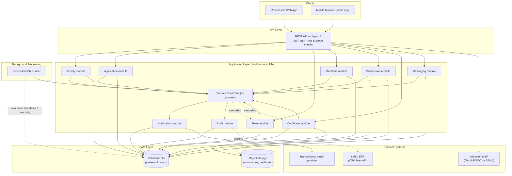

# VBridgeConnect — System Architecture

**Companion to:** VBridgeConnect Technical PRD (v2)
**Status:** Draft for engineering review
**Scope:** MVP pilot architecture — one department / project cohort

This document describes *how* the system in the PRD gets built: the components, the execution model behind every state transition, the data layer, and the security/integration boundaries. Requirement IDs (FR-XXX), principle IDs (PR-XX), and entity names below are the same ones used in the Technical PRD, so the two documents stay traceable to each other.

---

## 1. Architectural Style

**Recommendation: a modular monolith, not microservices, for the MVP.**

The pilot scope is one department and a handful of activities. A single deployable service with clearly separated internal modules gives the team fast iteration and one transaction boundary for the "single source of truth" principle (PR-01), without the operational overhead of distributed services the pilot doesn't need. Module boundaries are drawn along the same lines as the domain (Activities, Applications, Teams, Milestones, Submissions, Certificates, Messaging, Notifications, Audit) so any module can be extracted into its own service later without a rewrite — see [Section 15](#15-scalability--evolution-path).

**Core pattern:** client-server, REST API, one relational database as the system of record, a background job runner for time-based transitions, and an in-process domain event bus for cascading transitions. This combination is what every lifecycle table in the PRD (Section 9) is built on.

---

## 2. High-Level Component Diagram

---

## 3. Core Components

| Component | Responsibility |
|---|---|
| **REST API layer** | Single entry point for all clients. Authenticates every request (JWT), authorizes by role + scope, validates input, delegates to the relevant domain module. Never trusts a client-supplied role. |
| **Domain modules** | One module per entity family (Activity, Application, Team, Milestone, Submission, Certificate, Messaging). Each owns its own state-transition logic and is the only thing allowed to write to its tables. |
| **Domain Event Bus** | In-process publish/subscribe. A module completes a transition, emits an event (e.g. `milestone.overdue`), and any interested module reacts — without the two modules calling each other directly. This is what keeps cascading rules (Section 9's "event-driven" transitions) out of hidden database triggers and in visible, testable application code. |
| **Scheduled Job Runner** | Executes the time-based checks no single user action can trigger — see [Section 6](#6-background-jobs). |
| **Notification module** | Subscribes to domain events, fans out to in-app and email channels per the rules in PRD Section 10. |
| **Audit module** | Subscribes to every critical-transition event and writes an immutable record (actor, timestamp, entity, prior/new value, reason). Nothing else in the system can delete or edit an audit row. |
| **Relational database** | The single source of truth (PR-01). All dashboards, reports, and notifications are derived from live queries against it — never from a separately maintained tracker. |
| **Object storage** | Submission files and certificate attachments. The database stores only references (URL, checksum, size) — never file bytes. |

---

## 4. API Design

- **Style:** RESTful, resource-oriented, versioned under `/api/v1/`.
- **Resources:** `/activities`, `/applications`, `/teams`, `/milestones`, `/submissions`, `/certificates`, `/certificates/self-reported`, `/conversations`, `/messages`, `/notifications`, `/reports`.
- **Auth:** Bearer JWT on every request. Authorization is role- and scope-checked server-side on every endpoint — a coordinator's department scope, a mentor's assigned-activity scope, and a partner's explicitly-shared-project scope are all enforced in the application layer, never left to the client to respect.
- **State-transition endpoints are actions, not raw updates** — e.g. `POST /milestones/{id}/accept`, not `PATCH /milestones/{id} {status: "accepted"}`. This keeps every transition validated against the state machine in PRD Section 9 rather than allowing an arbitrary status write.
- **Idempotency:** transition endpoints accept an idempotency key so a retried request (flaky mobile network) can't double-fire a transition or a notification.
- **Capacity-sensitive endpoints** (e.g. `POST /applications/{id}/select`) run inside a database transaction with a row-level lock on the activity's capacity counter, so two concurrent selections can never oversell the same slot (this satisfies QA-10 in the PRD).
- **List endpoints** (dashboards, reports) support filtering, pagination, and return the applied filters + generation timestamp in the payload, so an export is reproducible.

---

## 5. Execution Model

Every state transition in the system is fired by exactly one of three mechanisms. This is the same model used throughout PRD Section 9 — repeated here as the canonical definition:

| Mechanism | When it's used | Where business logic lives |
|---|---|---|
| **REST API call** | A user or another service takes a synchronous, authenticated action (submit, approve, reject, accept). Validates rules, persists state, emits a domain event. | Application layer, inside the relevant domain module. |
| **Scheduled job** | A time-based or aggregate condition no single user action can trigger (a due date passing, an inactivity window elapsing). | Application layer, run by the job runner on a fixed interval. |
| **Event-driven internal listener** | One transition's domain event cascades a dependent state change in another module (e.g. `milestone.overdue` escalating team risk). | Application layer, as an explicit listener — **never a raw database trigger.** Keeping this logic in code keeps it visible, testable, and able to write its own audit entry, the same as any other transition. |

Raw database triggers are deliberately **not** used for business logic anywhere in this architecture — only for things a database trigger is actually meant for (e.g. `updated_at` timestamp maintenance).

---

## 6. Background Jobs

| Job | Frequency | Does |
|---|---|---|
| Milestone overdue sweep | Every 15 minutes | `SELECT` milestones where `due_date < NOW()` and status not in (`accepted`, `waived`, `overdue`); sets `overdue`; emits `milestone.overdue`. |
| Team inactivity / risk sweep | Every 6 hours | Compares each team's last-meaningful-activity timestamp to its configured inactivity window; escalates `on_track → watch`; also evaluates unresolved-blocker age against the escalation threshold for `at_risk → blocked`. |
| Activity auto-activation | On application-deadline pass (checked by the same 15-minute cadence) | Moves an activity from `applications_closed → active` if the owner configured an automatic start. |
| Archive sweep | Daily | Archives `completed`/`cancelled` activities that have passed the configured retention window, unless an admin already archived them manually. |

Two transitions look "scheduled" but are deliberately **not** jobs — they're synchronous, to avoid a window where the system is briefly in an inconsistent state:
- **Certificate eligibility → issuance**: evaluated and issued in the same transaction as the `activity.completed` event, not on a delay.
- **Capacity → waitlist routing**: evaluated inside the same transaction as the selection request, not by a later sweep.

---

## 7. Data Architecture

**Database:** one relational database as the system of record (PostgreSQL recommended — strong support for `UUID`, `ENUM`/check constraints, `TIMESTAMPTZ`, and row-level locking, all used above).

**Conventions, applied to every table:**
- Primary keys: `UUID` (v4).
- All timestamps: `TIMESTAMP WITH TIME ZONE`, stored in UTC.
- Enumerated fields (status, role, type): constrained string types (`ENUM` or a check constraint), validated at both the database and application layer.
- Every critical table carries `created_at` and `updated_at`.

**Core entities** (full purpose and relationships in PRD Section 14): `users`, `departments` / `terms`, `activities`, `applications`, `teams` / `team_membership`, `milestones`, `submissions`, `certificates`, `conversations` / `messages`, `notifications`, `audit_events`.

**Files never live in the database.** Submissions and certificate attachments go to object storage; the database holds a reference (URL, checksum, size, content type). Access to a stored file is via a short-lived signed URL issued by the API — no direct public bucket access.

---

## 8. Authentication & Authorization Architecture

| Account type | Protocol | Notes |
|---|---|---|
| Internal email/password accounts | Platform-issued **JWT** — short-lived access token + refresh token | Default for MVP where an institution has no SSO-capable IdP. |
| College-provided SSO-capable accounts | **OAuth 2.0 / OpenID Connect (OIDC)**, authorization-code flow | Preferred where the institution's IdP supports it; federates into the same JWT session model as internal accounts once authenticated. |
| Institutions whose IdP only supports SAML | **SAML 2.0** | Fallback path; also federates into a platform JWT after assertion validation. |
| Later: automated provisioning | **SCIM** over the SSO connection | Phase 2 — not MVP. |

**Authorization** is role- and scope-based, enforced server-side on every request (never inferred from the client):
- A **mentor** is scoped to activities/teams they're assigned to or own.
- A **coordinator** is scoped to their department/programme.
- An **industry partner** is scoped only to projects explicitly shared with them — grade and private-note endpoints are unreachable from a partner-scoped token regardless of the request made (this is what QA-03 in the PRD verifies).
- An **admin** has institution-wide configuration scope but no silent edit path to academic records.

This directly implements PR-06 (safe external collaboration) and the least-privilege access principle in PRD Section 4.

---

## 9. Messaging Architecture

- Each **group conversation** is scoped 1:1 to a workspace (activity/team). Each **direct conversation** requires the two participants to share at least one activity, team, or explicitly granted relationship (FR-122) — enforced at conversation-creation time, not just at read time.
- Removing a user from a team immediately revokes their access to that workspace's group conversation going forward; historical messages remain visible only to users who were members at the time (FR-123) — implemented as a membership-window check on read, not by deleting or hiding messages.
- Transport: REST for message history and sending; a lightweight push mechanism (WebSocket or long-poll) for near-real-time delivery is sufficient for MVP scale — no message broker required yet.
- Message content **never** leaves the platform. A later push-notification bridge to an external messaging app (Phase 2, per PRD Section 17) would carry only a notification payload ("You have a new message"), never the message body.
- Retention is a configurable, institution-set window; expiry is enforced by a background job, not by client-side deletion.

---

## 10. Security Architecture

| Concern | Approach |
|---|---|
| Transport | TLS everywhere; no unencrypted endpoint. |
| At rest | Database and object storage encrypted at rest. |
| File uploads | Malware-scanned before being accepted (submissions and certificate attachments alike). |
| File access | Short-lived, scoped signed URLs — never a permanently public link. |
| Rate limiting | Applied at the API gateway layer, particularly on auth and bulk-reminder endpoints. |
| Privileged accounts | MFA required for admin roles where feasible. |
| Audit | Every critical transition (state change, access grant/revocation, score release, sharing, record edit) is written to an append-only audit log, actor + timestamp + reason where applicable — never editable, viewable only by explicitly authorized roles. |

---

## 11. Integration Architecture

| Integration | MVP transport | Protocol |
|---|---|---|
| Identity | Login flow | JWT (internal) / OAuth2-OIDC or SAML 2.0 (institutional SSO) |
| Email | Outbound only | API-key or OAuth2 client-credentials against the transactional email provider |
| Calendar | Static export | `.ics` file generation — no external auth needed in MVP |
| Files | Platform storage + external links | Signed URLs (internal); no third-party auth in MVP |
| LMS/ERP | Offline exchange | CSV import/export in MVP; OAuth2 client-credentials or institution API key for Phase 2 server-to-server sync |
| Video/repository tools | Link storage only | No API calls in MVP |
| Messaging | Native, in-platform | Platform JWT session only; no external protocol |

---

## 12. Observability

- Structured logging across all modules, correlated by request ID.
- Error tracing on every API request and background job run.
- The audit log is treated as a first-class data product, not just an operational log — it's queryable by authorized roles, not only greppable by engineers.
- Dashboards expose their own data freshness and filter state (PRD Section 16), which requires the underlying query layer to track and surface `generated_at` on every report.

---

## 13. Deployment (MVP)

- Single-region deployment, sized for one department / pilot cohort.
- Environment separation: dev / staging / production, with no shared database between them.
- Automated, tested backups for the primary database.
- Graceful degradation: an email provider or LMS/ERP outage must not block core platform actions (submission, review, milestone updates) — these are decoupled via the event bus rather than called synchronously in the request path.

---

## 14. Non-Functional Requirements → Architectural Decisions

| NFR (PRD Section 16) | Architectural decision |
|---|---|
| Dashboards usable within ~3s | Reports/dashboards query pre-scoped, indexed views; heavy exports run as background jobs, not inline requests. |
| No loss of accepted submissions | Submissions are immutable once accepted; object storage versioning backs every file. |
| Role/scope authorization server-side | Enforced in the API layer on every request, independent of any client-side role display. |
| Auditability of critical transitions | Every domain module emits an event on transition; the Audit module is a mandatory subscriber, not optional instrumentation. |
| Mobile usability for high-frequency actions | REST API is client-agnostic; the same endpoints serve the responsive web client on any screen size. |

---

## 15. Scalability & Evolution Path

The modular monolith is a deliberate MVP choice, not a permanent ceiling. Natural extraction points, if/when pilot scale outgrows a single deployable:

1. **Messaging module** → separate service once message volume or real-time delivery requirements grow past what long-poll/WebSocket-on-the-monolith can handle.
2. **Notification module** → separate service if fan-out volume (digest emails, push) becomes a load concern.
3. **In-process event bus → real message broker** (e.g. SQS, RabbitMQ) — only needed once event producers and consumers no longer live in the same process, i.e. once (1) or (2) happen.
4. **Reporting/analytics** → a read replica or a separate reporting store, if heavy exports start contending with transactional load.

None of these require a redesign of the domain model or the FR-XXX contracts in the PRD — only a change in *where* a module runs, not *what* it does.

---

## 16. Open Architectural Decisions

These mirror the open questions in PRD Section 21, framed for engineering:

- Confirm database engine (PostgreSQL recommended) and hosting environment (institutional constraint vs. cloud-managed).
- Confirm which institutions require SAML vs. OIDC for SSO — affects the auth module's protocol support from day one.
- Confirm message retention period, which determines the background expiry job's default window.
- Confirm object storage provider (affects signed-URL implementation and malware-scanning integration).
- Confirm whether the pilot department's LMS/ERP can support anything beyond CSV exchange, which determines whether Phase 2 API sync is realistic.
