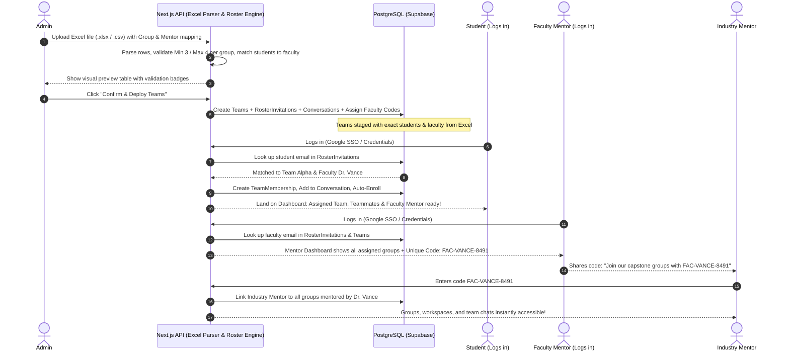

# Implementation Plan — Excel-Based Cohort Roster & Faculty-Student Auto-Connect System

## Goal Description
Enable administrators to upload an **Excel (.xlsx / .csv) file** containing pre-assigned student groups and their assigned faculty mentors. The system will:
1. **Parse the Excel File & Match Students to Faculty Mentors:** Read the pre-formed groups (validating group size: min 3, max 4) and match each student to their assigned group and faculty mentor.
2. **Stage Teams & Generate Unique Faculty Codes:** Automatically create the teams in the database, stage pending roster memberships, and generate a unique invite code for each faculty mentor (e.g., `FAC-VANCE-8491`).
3. **Seamless Post-Login Auto-Connection:** When any student or faculty mentor logs in, the system automatically detects their email, links them to their pre-matched team, unlocks their shared workspace, and connects them into their team chat.
4. **Industry Mentor Code Join:** Allow external Industry Mentors to enter a faculty member's unique code to seamlessly join that faculty's groups as co-mentors and reviewers.

---

### External API Requirement Analysis
> [!NOTE]
> **Do you need any external API for this?**
>
> **NO, you do NOT need any external API.**
>
> - **Excel parsing:** Handled 100% locally with standard in-app parsing (`xlsx` / `papaparse` / buffer reader).
> - **Student-Mentor Matching & Linking:** Handled 100% natively by your PostgreSQL (Prisma/Supabase) database.
> - **Post-Login Auto-Connection:** Handled natively inside NextAuth auth hooks.
> - **Faculty Codes & Industry Join:** Handled natively via internal database lookups.
>
> *(Optional: Email service like Resend/Sendgrid only if you wish to email users an invitation link).*

---

## Excel File Format Specification

The Admin uploads a simple spreadsheet (`.xlsx` or `.csv`) structured like this:

| Group Name | Student Name | Student Email | Faculty Mentor Name | Faculty Mentor Email |
| :--- | :--- | :--- | :--- | :--- |
| **Team Alpha** | Aarav Sharma | `aarav@uni.edu` | Dr. Katherine Vance | `vance@uni.edu` |
| **Team Alpha** | Diya Patel | `diya@uni.edu` | Dr. Katherine Vance | `vance@uni.edu` |
| **Team Alpha** | Rohan Gupta | `rohan@uni.edu` | Dr. Katherine Vance | `vance@uni.edu` |
| **Team Alpha** | Ananya Sen | `ananya@uni.edu` | Dr. Katherine Vance | `vance@uni.edu` |
| **Team Beta** | Ishan Roy | `ishan@uni.edu` | Dr. Katherine Vance | `vance@uni.edu` |
| **Team Beta** | Meera Nair | `meera@uni.edu` | Dr. Katherine Vance | `vance@uni.edu` |
| **Team Beta** | Kabir Das | `kabir@uni.edu` | Dr. Katherine Vance | `vance@uni.edu` |
| **Team Gamma** | Priya Verma | `priya@uni.edu` | Prof. Arjun Mehta | `mehta@uni.edu` |
| **Team Gamma** | Dev Kulkarni | `dev@uni.edu` | Prof. Arjun Mehta | `mehta@uni.edu` |
| **Team Gamma** | Sara Khan | `sara@uni.edu` | Prof. Arjun Mehta | `mehta@uni.edu` |
| **Team Gamma** | Neil Joshi | `neil@uni.edu` | Prof. Arjun Mehta | `mehta@uni.edu` |

### Built-in Validation Rules:
- **Group Size Check:** Every group in the file must have **minimum 3 and maximum 4 students**. If a group has fewer than 3 or more than 4, the system highlights the exact group in red before saving.
- **Faculty Consistency:** Each group must be assigned to a single faculty mentor.
- **Duplicate Prevention:** A student cannot be listed in multiple groups within the same activity.

---

## Proposed System Architecture & Flow



---

## Proposed Changes

### Component 1: Database & Data Models (Prisma)

#### [MODIFY] [schema.prisma](file:///c:/Users/Vedant/Downloads/V%20-%20Bridge%20connect/next-app/prisma/schema.prisma)
- Add `facultyCode String? @unique` to `User` model.
- Add `mentorId String? @db.Uuid` and `industryMentorId String? @db.Uuid` to `Team` model with relations to `User`.
- Create `RosterInvitation` model:
  ```prisma
  model RosterInvitation {
    id                 String    @id @default(uuid()) @db.Uuid
    activityId         String    @db.Uuid
    teamId             String    @db.Uuid
    email              String
    name               String?
    role               String    // 'student_lead' | 'student_member' | 'faculty_mentor'
    facultyMentorEmail String?
    claimed            Boolean   @default(false)
    claimedAt          DateTime? @db.Timestamptz
    claimedById        String?   @db.Uuid
    createdAt          DateTime  @default(now()) @db.Timestamptz

    activity           Activity  @relation(fields: [activityId], references: [id])
    team               Team      @relation(fields: [teamId], references: [id])
    claimedBy          User?     @relation(fields: [claimedById], references: [id])

    @@unique([teamId, email])
    @@index([email, claimed])
    @@map("roster_invitations")
  }
  ```

---

### Component 2: Backend Logic & Excel Processing

#### [NEW] [excel-parser.ts](file:///c:/Users/Vedant/Downloads/V%20-%20Bridge%20connect/next-app/src/lib/modules/roster/excel-parser.ts)
- Parses `.xlsx` and `.csv` buffers.
- Normalizes column names (`Group Name` / `Team Name`, `Student Email`, `Faculty Mentor Email`).
- Groups rows by `groupName`.
- Validates constraints:
  - Each group has between 3 and 4 students.
  - Exactly one faculty mentor per group.
  - Valid email syntax.
- Returns structured JSON for admin preview:
  ```ts
  interface ParsedRosterGroup {
    groupName: string;
    students: { name: string; email: string }[];
    mentor: { name: string; email: string };
    isValid: boolean;
    errorReason?: string;
  }
  ```

#### [NEW] [roster.service.ts](file:///c:/Users/Vedant/Downloads/V%20-%20Bridge%20connect/next-app/src/lib/modules/roster/roster.service.ts)
- `deployExcelRoster(activityId: string, groups: ParsedRosterGroup[])`:
  - Executes in a Prisma `$transaction`.
  - For each group:
    1. Creates `Team` linked to the activity.
    2. Creates group `Conversation` linked to the team.
    3. Finds or stages `facultyCode` for the faculty mentor.
    4. Inserts `RosterInvitation` records for the 3-4 students and the faculty mentor.
    5. If any student or mentor is already registered in the system, connects them immediately.
- `autoConnectUserOnLogin(user: { id: string, email: string })`:
  - Called in NextAuth `signIn` callback.
  - Automatically matches user email with pending `RosterInvitation`s.
  - Links student to `TeamMembership` and team conversation.
  - Links faculty to `Team.mentorId` and team conversation.
- `joinCohortWithFacultyCode(industryUserId: string, facultyCode: string)`:
  - Validates faculty code.
  - Connects Industry Mentor to all teams assigned to that faculty mentor.

#### [NEW] [route.ts (Excel Upload API)](file:///c:/Users/Vedant/Downloads/V%20-%20Bridge%20connect/next-app/src/app/api/v1/admin/roster/upload/route.ts)
- `POST /api/v1/admin/roster/upload`: Accepts file upload (`multipart/form-data` or JSON payload), runs parser & validation, and returns preview.
- `POST /api/v1/admin/roster/deploy`: Accepts validated groups and commits to the database.

#### [NEW] [route.ts (Faculty Code Join API)](file:///c:/Users/Vedant/Downloads/V%20-%20Bridge%20connect/next-app/src/app/api/v1/mentor/join-code/route.ts)
- `POST /api/v1/mentor/join-code`: Industry partner inputs faculty code to join groups.

#### [MODIFY] [auth.ts](file:///c:/Users/Vedant/Downloads/V%20-%20Bridge%20connect/next-app/src/lib/auth/auth.ts)
- Call `rosterService.autoConnectUserOnLogin` in the NextAuth `signIn` callback.

---

### Component 3: Frontend User Interface

#### [NEW] [ExcelRosterUploader.tsx](file:///c:/Users/Vedant/Downloads/V%20-%20Bridge%20connect/next-app/src/screens/admin/ExcelRosterUploader.tsx)
- Placed at `/admin/roster`:
  - **Activity Selector**: Dropdown to select project/course.
  - **Drag-and-Drop Zone**: Accepts `.xlsx` or `.csv` with a "Download Sample Excel Template" button.
  - **Interactive Preview Table**:
    - Displays parsed teams with student count chips (e.g. `4 Students` in green, `2 Students` in red error badge).
    - Shows matched Faculty Mentor and generated `facultyCode`.
    - "Fix Group" quick edit or "Deploy Roster" primary button.

#### [MODIFY] [MentorDashboard.tsx](file:///c:/Users/Vedant/Downloads/V%20-%20Bridge%20connect/next-app/src/screens/mentor/MentorDashboard.tsx)
- Top banner with faculty's unique invite code:
  - `Your Industry Partner Code: FAC-VANCE-8491`
  - "Copy Code" button to share with industry mentors.
  - Lists all 3-to-4 student groups assigned to this faculty from the Excel sheet.

#### [NEW] [JoinCohortModal.tsx](file:///c:/Users/Vedant/Downloads/V%20-%20Bridge%20connect/next-app/src/components/mentor/JoinCohortModal.tsx)
- Pop-up modal for Industry Partners to enter faculty code and connect to groups.

---

## Verification Plan

### Automated Tests
- Create [roster.service.test.ts](file:///c:/Users/Vedant/Downloads/V%20-%20Bridge%20connect/next-app/tests/roster.service.test.ts):
  - **Test 1 (Excel Parsing & Validation):** Verify that rows are correctly grouped by `Group Name`, validates 3-4 students per group, flags groups with invalid sizes.
  - **Test 2 (Roster Deployment):** Verify teams and roster records are stored in PostgreSQL with proper faculty mentor links.
  - **Test 3 (Student Auto-Connect on Login):** Verify student is matched to their exact Excel-assigned group and mentor upon login.
  - **Test 4 (Faculty Auto-Connect & Code):** Verify faculty mentor sees all assigned groups from Excel and unique `facultyCode` is created.
  - **Test 5 (Industry Partner Code Join):** Verify industry partner entering `facultyCode` joins all teams under that faculty.

### Manual Verification
1. Download sample Excel template from `/admin/roster`.
2. Fill template with 2 groups (Group A with 4 students assigned to Prof. Vance; Group B with 3 students assigned to Prof. Mehta).
3. Upload to `/admin/roster` $\rightarrow$ Confirm preview displays both groups as valid.
4. Click "Deploy Roster" $\rightarrow$ Confirm database records created.
5. Log in as a student in Group A $\rightarrow$ Verify immediate access to Group A with teammates and Prof. Vance.
6. Log in as Prof. Vance $\rightarrow$ Confirm Group A appears with invite code `FAC-VANCE-XXXX`.
7. Log in as Industry Partner $\rightarrow$ Submit `FAC-VANCE-XXXX` $\rightarrow$ Confirm Group A workspace and chat are accessible.
